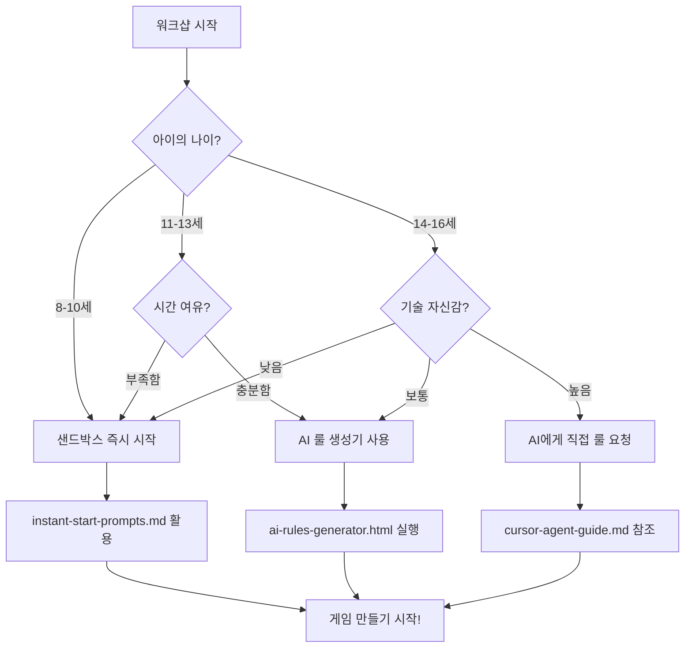

# 🎯 워크샵 진행 의사결정 플로우차트

## 🚦 시작 지점 결정하기



## 📋 5분 단위 진행 체크리스트

### ⏱️ 0-5분: 환경 확인
- [ ] Cursor 실행 확인
- [ ] Live Server 작동 확인
- [ ] 아이의 에너지 레벨 파악
- [ ] 부모님 참여도 확인

### ⏱️ 5-10분: AI 설정
**경로 A (즉시 시작)**
- [ ] `instant-start-prompts.md` 열기
- [ ] 아이가 프롬프트 선택
- [ ] 복사하여 Cursor에 붙여넣기
- [ ] 첫 대화 시작

**경로 B (맞춤 설정)**
- [ ] AI 룰 생성기 실행
- [ ] 4가지 질문 완료
- [ ] `.cursorrules` 적용
- [ ] 첫 대화 시작

### ⏱️ 10-15분: 첫 성공 경험
- [ ] 캐릭터 화면에 표시
- [ ] 간단한 움직임 구현
- [ ] "와! 움직여!" 순간 만들기
- [ ] 첫 성공 축하하기

### ⏱️ 15-30분: 게임 발전
- [ ] 상호작용 추가
- [ ] 규칙 만들기
- [ ] 점수 시스템
- [ ] 자유로운 커스터마이징

### ⏱️ 30-40분: 마무리
- [ ] 게임 완성도 점검
- [ ] 친구들과 공유
- [ ] 다음 목표 설정
- [ ] 집에서 계속하기 안내

## 🚨 긴급 상황 대처 매뉴얼

### 상황 1: "AI가 너무 어렵게 설명해요"
```
해결책:
1. 즉시 개입: "더 쉽게 설명해줘"
2. 나이 설정 낮추기: "나는 8살처럼 설명해줘"
3. 이모지 요청: "이모지 많이 써서 설명해줘"
```

### 상황 2: "설정이 10분 넘게 걸려요"
```
해결책:
1. 30초 규칙 발동
2. "이미 준비된 선생님과 시작하자!"
3. Workflow 1 (친절한 선생님) 즉시 적용
```

### 상황 3: "아이가 흥미를 잃어요"
```
해결책:
1. 게임 종류 변경: "다른 게임 만들어볼까?"
2. 즉각적 보상: "폭발 효과 넣어보자!"
3. 친구 참여: "친구 캐릭터도 넣어볼까?"
```

## 📊 성공률 기반 추천

### 🥇 최고 성공률 (95%+)
- **8-10세**: 샌드박스 + 친절한 선생님
- **11-13세**: AI 룰 생성기 + 부모 도움
- **14-16세**: 직접 프롬프트 작성

### 🥈 안정적 성공률 (80%+)
- **모든 연령**: instant-start-prompts.md 활용
- **진행자 주도**: 미리 준비된 워크플로우
- **시간 제약**: 30초 규칙 엄격 적용

### 🥉 도전적 시도 (60%+)
- **AI 자율 생성**: 고급 학습자만
- **완전 자유 형식**: 경험자 대상
- **실험적 접근**: 여유 시간 필수

## 💡 진행자를 위한 골든 룰

### ✅ 항상 지켜야 할 것
1. **즐거움 우선**: 완성도보다 재미
2. **성공 보장**: 모든 아이가 게임 완성
3. **유연한 대처**: 상황에 따라 경로 변경
4. **긍정적 피드백**: 작은 성취도 크게 축하

### ❌ 절대 하지 말아야 할 것
1. **디버깅 시도**: 에러 분석 금지
2. **기술 설명**: 코드 설명 최소화
3. **비교하기**: 아이들 간 비교 금지
4. **서두르기**: 아이의 속도 존중

## 🎯 최종 의사결정 트리

```
시작
├─ 시간 여유 있음? (10분+)
│  ├─ YES → 맞춤 설정 시도
│  └─ NO → 즉시 시작 프롬프트
├─ 아이가 주도적?
│  ├─ YES → AI와 직접 대화
│  └─ NO → 부모와 함께 설정
└─ 기술적 어려움?
   ├─ YES → 샌드박스 기본값
   └─ NO → 계획대로 진행
```

---

**핵심 메시지**: 완벽한 설정보다 빠른 시작과 성공 경험이 중요합니다! 
30초 안에 결정하고, 안 되면 바로 Plan B로! 🚀